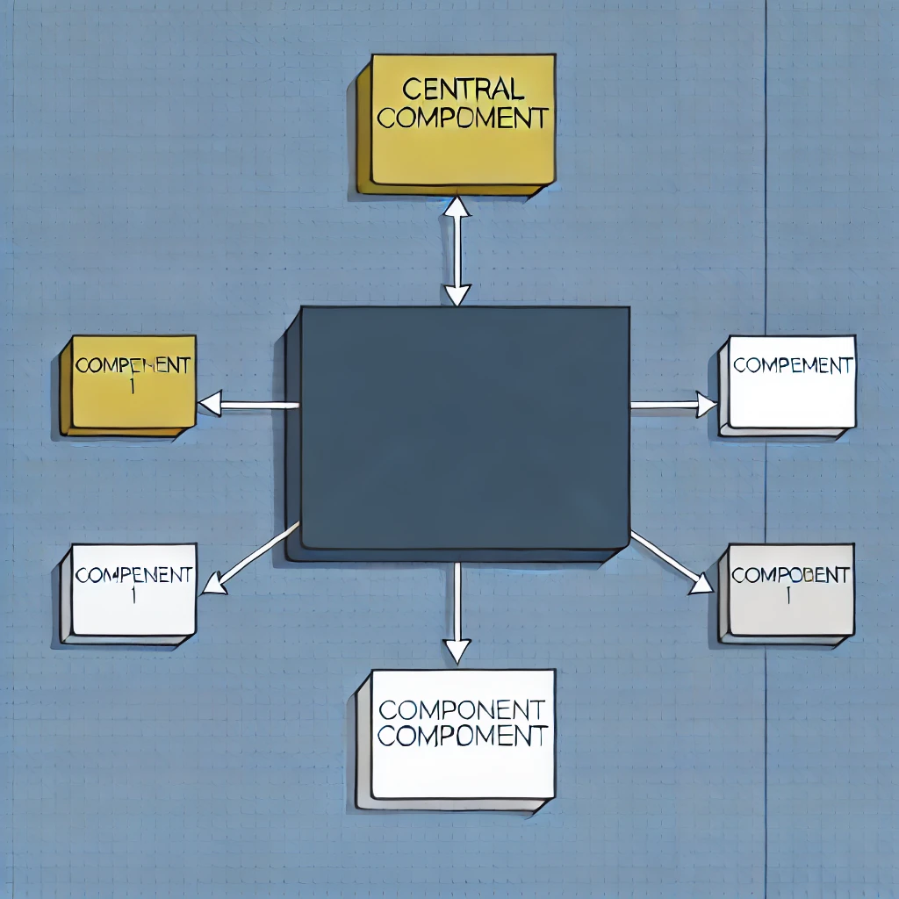
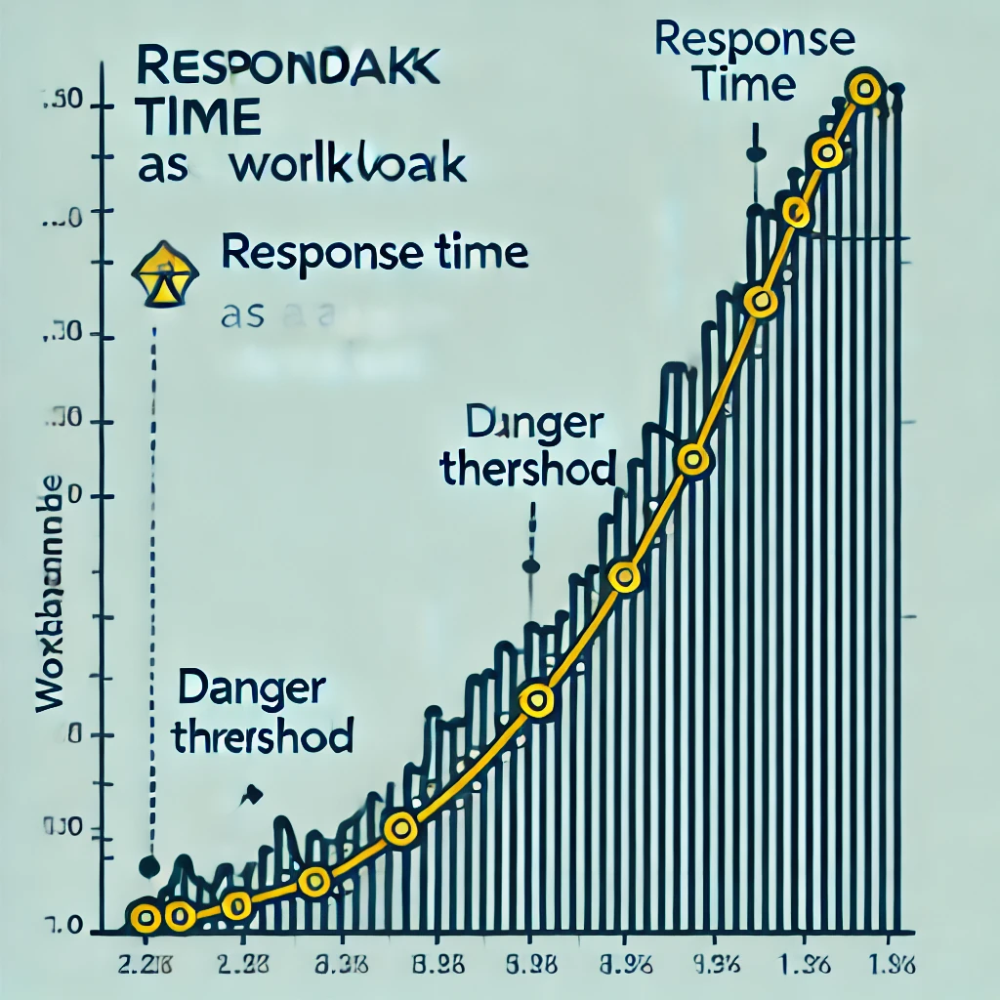
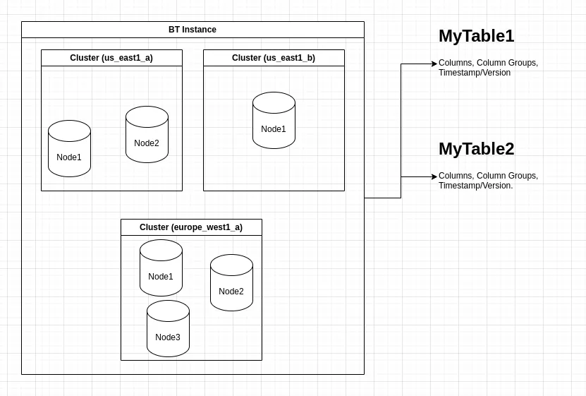
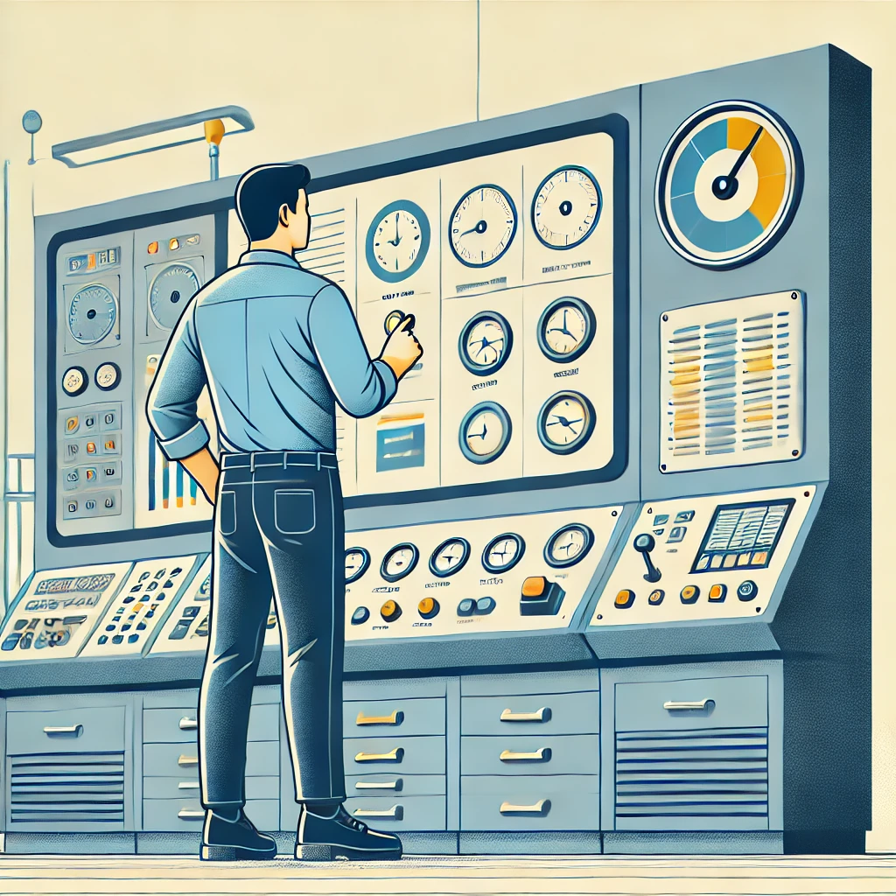

:title: The journey of a Bigtable migration
:css: ./css/main.css
:keywords: bigtable, gcp

.. footer::

    Google Extended I/O Cali 2024

----

The journey of a Bigtable migration
====================================

:author: Pedro León Rivera Wilches
:date: 2024/07/13

----

Agenda
======

- Project Overview
- Why Bigtable?
- Design & Planning
- Implementation Experience
- Lessons Learned
- Conclusion
- Q&A

----

Problem Overview
================

**Critical component:**

- high demand and workload
- critical performance

----

Problem Overview
=================

**Limitations of the Previous Database:**

- performance on high workload spikes

----

Why Bigtable?
=============

- workload support
- service documentation(*)
- datacenter distribution
- terraform integration

----

Design & Planning
==================

**Migration Planning:**

- Infrastructure/scalability
- Schemas re-design
- Software integration
- Maintainance planning

----

Infrastructure & Scalability
=============================

**To figure out:**

- Cluster: when, how many
- Nodes: max/min, rescale criteria
- Data management policies
- IAM roles and permissions

.. note::

    in terraform talk about multiple-provider to create instances with different zone

----

Schemas re-design
=============================

**Data structure oriented to query**

.. code:: python

    {
    "created_at": "2024-06-10T15:40:00ZGMT-5",  #--- IS THIS STILL REQUIRED?
    "dog": {             #--- THIS COULD BE A COLUMN GROUP PET
        "name": "Buddy",
        "breed": "Golden Retriever",
        "age": 3,
        "weight": 30,
        "vaccinations": [
        "Rabies",
        ]
    },
    "hiking_session": { #--- THIS COULD BE A COLUMN GROUP EXERCISE
        "date": "2024-07-12",
        "location": "Blue Mountain Trail",
        "distance_km": 5.6,
        "duration_hours": 2.5,
        "participants": [
        "John Doe",
        "Buddy"
        ],
        "weather": {
        "temperature_celsius": 22,
        "conditions": "Sunny"
        },
        "notes": "Buddy enjoyed the hike and showed great energy throughout the session."
    },
    "wash_session": { # THIS COULD BE A COLUMN GROUP CLEANING
        "date": "2024-07-13",
        "location": "Pet Grooming Salon",
        "duration_minutes": 45,
        "services": [
        "Shampoo",
        "Nail Clipping",
        "Ear Cleaning"
        ],
        "groomer": "Alice Johnson",
        "notes": "Buddy was calm during the wash and grooming session."
    }
    }

----

Schemas re-design
=============================

**Migration Steps:**

- Process of migrating data
- Handling challenges (data inconsistencies, integrity)
- Data migration (Canary deploy)

----

Software Integration
=============================

**Adapting Existing Services:**

- New db driver
- Support Sync / Async

.. image:: ./img/adapt_design.webp
    :width: 400px

----

Software Integration
=============================

**Performance Testing:**

- Post-migration performance testing and optimization

----

Maintainance planning
=============================

- Backups
  - Autobackup(*)
  - Custom Legacy Backup
- Monitoring (service-side)

----

Things we learned
========================

.. csvtable::
    :header: "Problem", "How to deal it"

    "Bad python documentation", "Read source code + service docs"
    "Sync client performance", "Dedicated IO loop to handle async grpc for sync environments"
    "Backup", "Autobackup + lifespan management"

----

Conclusion
==========

**Summary:**
- Recap of the journey

**Final Thoughts:**
- Encouragement for teams to consider Bigtable

----

Q&A
===

